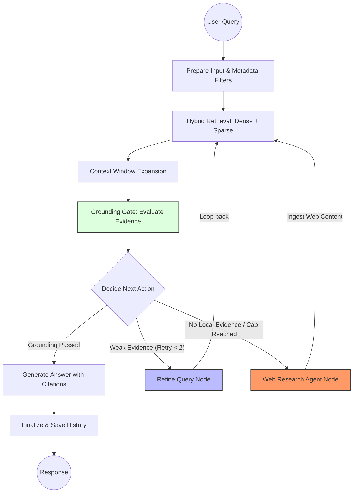

# Rabbook

Rabbook is an advanced Retrieval-Augmented Generation (RAG) application for asking questions over personal documents and global web knowledge. I built it as a personal AI engineering project to explore how a real RAG system moves beyond basic vector search into a reliable, agentic, and self-improving product.

The app supports document upload, URL import, grounded answering with citations, retrieval debugging, document management, chat history, saved notes, and export features.

## Why This Project Matters

Most beginner RAG projects stop at embedding documents and calling an LLM. Rabbook goes further by adding retrieval quality improvements, agentic self-correction, and autonomous research capabilities:

- **Agentic RAG (LangGraph):** Moves beyond linear pipelines. Features a self-correcting loop that evaluates retrieval evidence, refines queries when grounding is weak, and handles retries.
- **Autonomous Research Agent:** A dedicated agent that plans and executes multi-query web searches (via DuckDuckGo) when local documents are insufficient.
- **Self-Expanding Knowledge Loop:** The Research Agent doesn't just synthesize text; it *ingests* web findings back into the vector store, allowing the RAG pipeline to provide grounded answers over fresh internet data.
- **Hybrid Retrieval:** Combined Dense (Chroma) and Sparse (BM25) search using Reciprocal Rank Fusion (RRF) and Cross-Encoder reranking.
- **Semantic Chunking:** Advanced document segmentation using embeddings to find natural break points.
- **Context Expansion:** Intelligent context windowing that fetches neighboring chunks to provide the LLM with full document context.
- **Citation Validation:** Rigorous post-generation checks to ensure every claim is backed by a specific source.
- **Answer-Level Evaluation:** Built-in scripts to measure groundedness and correctness, moving beyond "it looks good" to data-driven improvement.

## Architecture

Rabbook uses a hierarchical evidence strategy to ensure accuracy and privacy:

1. **Local Search:** Fast and private search over your uploaded documents.
2. **Refined Retry:** If initial results are weak, the agent rewrites the query to try and find better local evidence.
3. **Global Research:** If local data fails, the agent searches the web, ingests the content into the vector store, and performs a final RAG pass over the combined knowledge.

### Agentic Flow (LangGraph)



## Core Features

- Ask questions over PDF, TXT, and persisted URL-imported content
- Autonomous web fallback for questions beyond your local library
- View retrieved chunks, retrieval scores, rerank scores, and debug flow
- Filter retrieval by document, file type, and page range
- Manage a document library directly from the UI
- Save answers as notes and automatically keep chat history
- Export notes, history, and answers as Markdown or JSON
- Run maintenance actions such as runtime refresh, registry rebuild, and upload re-ingestion

## Tech Stack

- **Backend:** FastAPI, Python
- **Orchestration:** LangGraph (Agentic Loops)
- **Vector DB:** Chroma
- **Embeddings:** Hugging Face `all-MiniLM-L6-v2`
- **Sparse Retrieval:** Rank-BM25
- **Reranking:** Cross-Encoder `ms-marco-MiniLM-L-6-v2`
- **LLM:** Groq-hosted Llama 3.1 or Google Gemini
- **Frontend:** Jinja2 templates, Vanilla CSS

## Installation & Setup

1. **Clone and Setup environment:**
   ```bash
   python -m venv venv
   source venv/bin/activate
   pip install -r requirements.txt
   ```

2. **Configure API Keys:**
   Create a `.env` file (see `.env.example`):
   ```bash
   GEMINI_KEY=your_key_here
   RABBOOK_ENABLE_LANGGRAPH_AGENT=true
   RABBOOK_ENABLE_RESEARCH_FALLBACK=true
   ```

3. **Run the application:**
   ```bash
   python main.py
   ```
   Open `http://127.0.0.1:6001`.

## Evaluation

Rabbook includes an evaluation script for the full RAG flow, not just retrieval in isolation. The evaluation covers:

- answer correctness
- grounded answer behavior
- safe fallback behavior when evidence is insufficient

This makes the project more useful as an engineering artifact because improvements can be measured instead of judged only by intuition.

## Notes

- Browsers commonly block port `6000`, so the app defaults to `6001`.
- Uploaded files are stored under `data/uploads/`.
- URL imports are persisted under `data/uploads/urls/` so they survive re-ingestion.
- Supported direct-run entrypoints are `main.py`, `ingest_docs.py`, and `evaluate_retrieval.py`.
