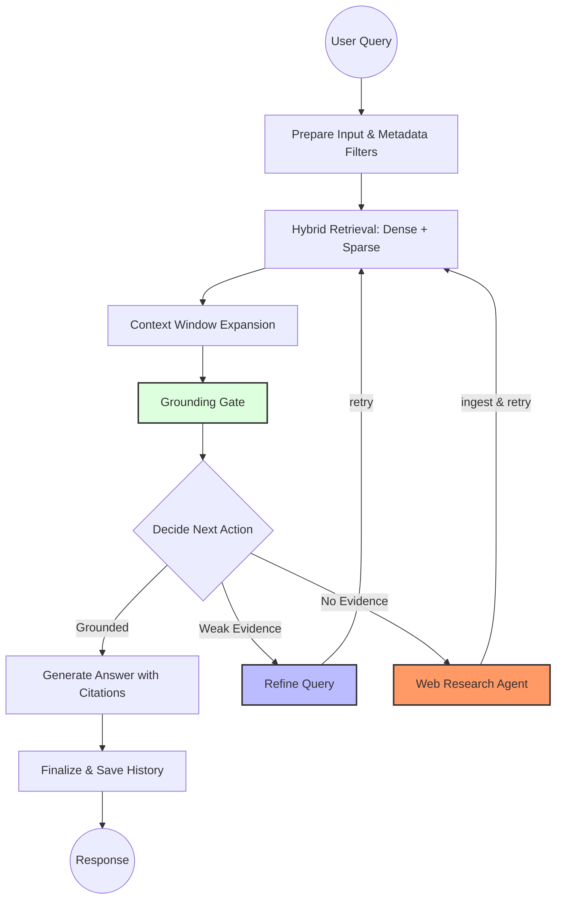

# Rabbook — Agentic RAG System

> A production-quality Retrieval-Augmented Generation application built from scratch, featuring a real tool-use agent loop, hybrid retrieval, and a self-expanding knowledge base.


---

## What Makes This Different

Most RAG projects embed documents and call an LLM. Rabbook is built the way production systems are built:

| What | Why It Matters |
|------|----------------|
| **Real tool-use agent loop** | The LLM decides which tool to call each turn — not a hardcoded pipeline. Mirrors how Claude, Codex, and Gemini work. |
| **7-stage retrieval pipeline** | Dense + sparse fusion → RRF → cross-encoder reranking → context expansion → grounding gate. Each stage is measurable and independently testable. |
| **Self-expanding knowledge base** | When the agent fetches a web page, it auto-embeds it. Future queries over that content go through the full RAG pipeline — not raw text. |
| **Multi-provider LLM support** | Groq (Llama), Google Gemini, and local Ollama models (including thinking-mode toggle). Swap providers with a single env var. |
| **57 unit tests, zero LLM calls** | Full mock coverage across retrieval, agent loop, research graph, and structured output. |

---

## Two Agent Modes

### Mode 1 — Tool-Use Agent Loop (`agents/tool_agent.py`)

A real agentic loop where the LLM autonomously picks tools until it has enough information to answer. No hardcoded routing.

```
User query
    └─▶ LLM decides tool call
            ├─▶ query_documents  →  hybrid RAG search over local library
            ├─▶ web_search       →  DuckDuckGo, returns URLs + snippets
            └─▶ fetch_url        →  crawls page, auto-embeds into Chroma,
                                    returns "indexed — use query_documents"
    └─▶ LLM calls query_documents again → hits newly embedded content
    └─▶ LLM produces final grounded answer
```

The `fetch_url → embed → query_documents` pattern means every fetched page permanently enriches the local library for future queries.

### Mode 2 — LangGraph RAG Graph (`agents/rag_graph.py`)

A deterministic graph for structured, auditable retrieval with explicit grounding gates.



Switch modes with `RABBOOK_ENABLE_TOOL_AGENT=true/false`.

---

## Retrieval Pipeline

Seven stages run in sequence on every query:

```
1. Query Transform     LLM generates 2–4 sub-queries for broader coverage
2. Candidate Collection Dense (Chroma) + BM25 results per sub-query, deduplicated
3. RRF Fusion          Reciprocal Rank Fusion merges the ranked lists
4. Cross-Encoder Reranking  ms-marco-MiniLM re-scores against the original query
5. Context Window Expansion  Neighboring chunks added for full document context
6. Grounding Gate      Rerank score + chunk count gate; blocks hallucination-prone answers
7. Answer Generation   Structured output with citation repair fallback
```

---

## Tech Stack

| Layer | Technology |
|-------|-----------|
| Backend | FastAPI, Python 3.13 |
| Agent Orchestration | LangGraph, LangChain tool-use (`bind_tools`) |
| Vector Store | ChromaDB |
| Embeddings | `all-MiniLM-L6-v2` (HuggingFace, local) |
| Sparse Retrieval | Rank-BM25 |
| Reranking | `ms-marco-MiniLM-L-6-v2` Cross-Encoder |
| LLM Providers | Groq (Llama 3.x), Google Gemini, Ollama (local, thinking-mode aware) |
| Web Crawling | crawl4ai + DuckDuckGo (`ddgs`) |
| Frontend | Jinja2, Vanilla CSS |
| Testing | `unittest` + mocks, 57 tests, no real LLM calls |

---

## Project Structure

```
agents/
  tool_agent.py       — real tool-use agent loop (the main path)
  rag_graph.py        — LangGraph deterministic graph
  research_graph.py   — standalone web research agent
  services.py         — public API: answer_query(), AnswerResult
rag/
  retrieve.py         — full 7-stage retrieval pipeline
  chunking.py         — semantic chunking (embedding-based split points)
  ingest.py           — document loading → Chroma + chunk registry
  web_ingest.py       — URL fetch, crawl, save, web_search
  registry.py         — chunk registry (O(1) neighbor lookup for context expansion)
app/
  web.py              — FastAPI routes, LLM instantiation, provider switching
  runtime.py          — lazy-load & cache: vectorstore, BM25, registry
core/
  config.py           — all env vars with defaults
```

---

## Setup

```bash
git clone <repo>
cd rabbook

python -m venv venv
source venv/bin/activate
pip install -r requirements.txt

cp .env.example .env
# Add GROQ_API_KEY or GEMINI_KEY
```

Key `.env` options:

```bash
RABBOOK_LLM_PROVIDER=groq          # groq | gemini | ollama
RABBOOK_LLM_MODEL=llama-3.1-8b-instant
RABBOOK_ENABLE_TOOL_AGENT=true     # real agent loop (recommended)
RABBOOK_ENABLE_LANGGRAPH_AGENT=true
RABBOOK_ENABLE_RESEARCH_FALLBACK=false
RABBOOK_OLLAMA_THINKING=false      # suppress <think> blocks for gemma/deepseek
```

```bash
python main.py          # → http://127.0.0.1:6001
python ingest_docs.py   # embed files from data/uploads/
python evaluate_retrieval.py  # measure groundedness & correctness
```

---

## Running Tests

```bash
python -m pytest tests/ -q
# 57 passed
```

All tests use mocks — no API keys, no network, no vectorstore required.

---

## Evaluation

`evaluate_retrieval.py` measures the full pipeline end-to-end:

- Answer correctness vs. ground truth
- Grounded vs. hallucinated answer rate
- Safe fallback behavior when evidence is insufficient

Improvements are data-driven, not intuition-based.

---

## Notes

- Port defaults to `6001` (browsers commonly block `6000`)
- Uploaded files: `data/uploads/`
- URL imports: `data/uploads/urls/` (persisted, re-ingested on restart)
- Chunk registry: `data/chunk_registry.json` (flat index for O(1) neighbor lookup)
