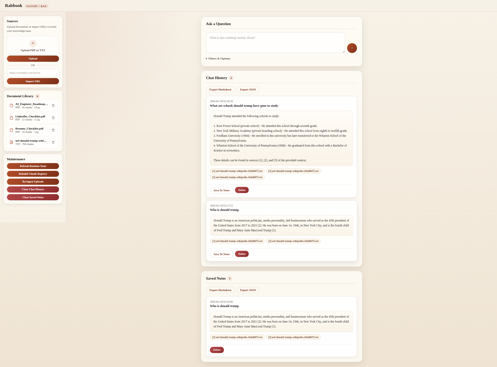
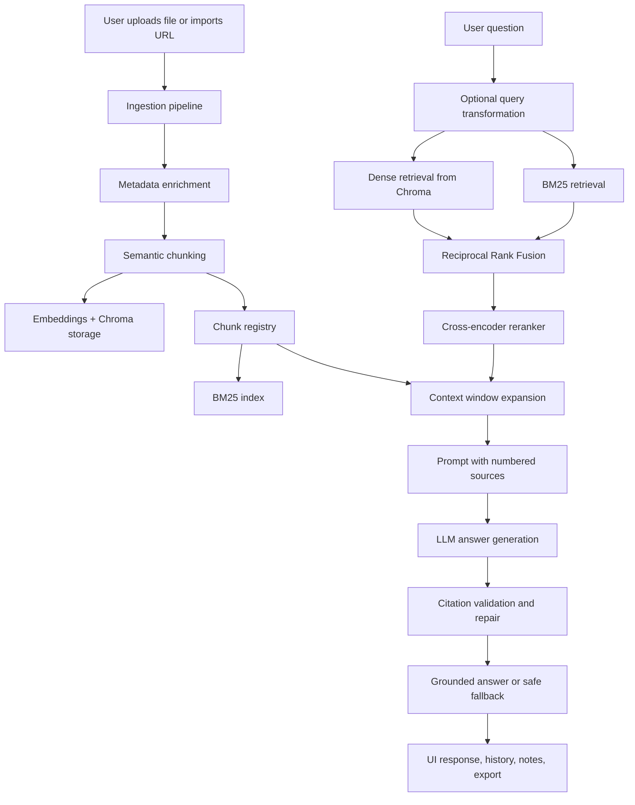

# Rabbook

Rabbook is a retrieval-augmented generation application for asking questions over personal documents and imported web pages. I built it as a personal AI engineering project to explore how a real RAG system moves beyond basic vector search into a more reliable, inspectable, and user-friendly product.

The app supports document upload, URL import, grounded answering with citations, retrieval debugging, document management, chat history, saved notes, and export features. The goal is not only to generate answers, but to make the retrieval and grounding process visible and controllable.

## Why This Project Matters

Most beginner RAG projects stop at embedding documents and calling an LLM. Rabbook goes further by adding retrieval quality improvements, safety checks, and practical product features:

- semantic chunking for better document segmentation
- metadata-aware retrieval and filtering
- dense retrieval plus BM25 hybrid retrieval
- reciprocal rank fusion and reranking
- context window expansion for neighboring chunks
- citation generation with validation and repair
- grounded fallback behavior when evidence is weak
- answer-level evaluation for end-to-end RAG testing

This project represents how I think about AI systems in practice: retrieval quality, observability, reliability, and user workflow all matter.

## Demo

Add a screenshot or short UI capture to `docs/images/rabbook-demo.png` and the README will render it here.



## Core Features

- Ask questions over PDF, TXT, and persisted URL-imported content
- Import a single web page and store it as a durable local source
- View retrieved chunks, retrieval scores, rerank scores, and debug flow
- Filter retrieval by document, file type, and page range
- Manage a document library directly from the UI
- Save answers as notes and automatically keep chat history
- Export notes, history, and answers as Markdown or JSON
- Run maintenance actions such as runtime refresh, registry rebuild, and upload re-ingestion

## Retrieval Pipeline

Rabbook uses a multi-stage retrieval pipeline instead of a single similarity search:

1. Query transformation can generate sub-queries for broader recall.
2. Dense retrieval and BM25 retrieval gather candidate chunks.
3. Reciprocal Rank Fusion merges those ranked candidate sets.
4. A cross-encoder reranker reorders candidates against the original user question.
5. Context window expansion adds neighboring chunks from the same document.
6. The final answer is generated with numbered citations.
7. A grounding gate blocks unsupported answers and returns a safe fallback when evidence is too weak.

## System Flow



## Tech Stack

- FastAPI for the web application
- Jinja2 templates and custom CSS for the UI
- Chroma as the vector database
- Hugging Face embeddings with `sentence-transformers/all-MiniLM-L6-v2`
- `rank-bm25` for sparse retrieval
- LangChain `SemanticChunker` for chunking
- Cross-encoder reranking with `cross-encoder/ms-marco-MiniLM-L-6-v2`
- Groq-hosted LLM inference for answer generation

## Project Structure

```text
rabbook/
├── main.py
├── ingest_docs.py
├── evaluate_retrieval.py
├── app/
├── core/
├── rag/
├── templates/
├── static/
├── tests/
├── data/
├── requirements.txt
└── README.md
```

## Run Locally

```bash
python -m venv venv
source venv/bin/activate
pip install -r requirements.txt
cp .env.example .env
python main.py
```

Open `http://127.0.0.1:6001`.

Useful commands:

```bash
python ingest_docs.py
python evaluate_retrieval.py
```

## Evaluation

Rabbook includes an evaluation script for the full RAG flow, not just retrieval in isolation. The evaluation covers:

- answer correctness
- grounded answer behavior
- safe fallback behavior when evidence is insufficient

This makes the project more useful as an engineering artifact because improvements can be measured instead of judged only by intuition.

## Notes

- Browsers commonly block port `6000`, so the app defaults to `6001`.
- Uploaded files are stored under `data/uploads/`.
- URL imports are persisted under `data/uploads/urls/` so they survive re-ingestion.
- Supported direct-run entrypoints are `main.py`, `ingest_docs.py`, and `evaluate_retrieval.py`.
